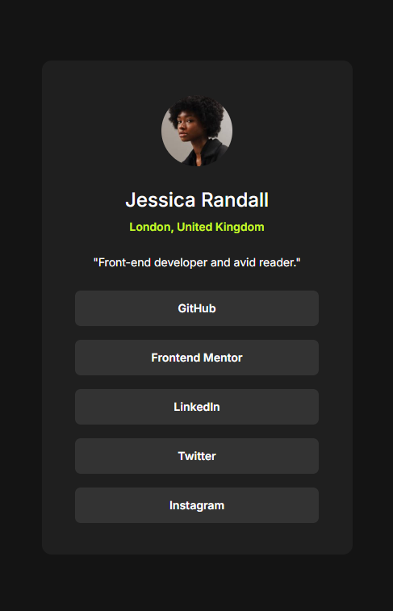

# Perfil de Links Sociais

## Visão geral

### O desafio

Os usuários devem ser capazes de:

&#9989; Ver estados de foco e hover para todos os elementos interativos na página

### Captura de tela

<div align="center">
    <p>
    </img>
    </p>
</div>

### Links

&#128270; URL da solução: https://abrir.link/OCcLP

&#128270;URL do site ativo: https://abrir.link/LEhVH

## Meu processo

### Construído com

- Marcação semântica HTML5
- Propriedades personalizadas CSS

### O que eu aprendi

Foi desafiador iniciar esse projeto, mais ao mesmo tempo me sentia encorajado e curioso. Colocar em prática o conhecimento que ao longo dos dias vinha exercitando ao estudar HTML e CSS. Tive dificuldade em posicionar div's pai e seus elementos filhos, depois de algumas longas horas ao conseguir posiciona-las, vinha também a euforia de ter avançado mais um etapa no projeto onde parei algumas vezes para observar como estava sendo estruturado e escrito cada linha de código na página HTML, com isso fui desenvolvendo a percepção de ter um olhar mais crítico, ao ir escrevendo trechos, e quais informações ali deveriam constar.

### Algum dos códigos de me orgulho

&#128073;&#127996; Usando o atributo -alt- pensando na acessibilidade dos usuários com deficiência visual quando usarem o leitor de tela

```html
<h1 class="title-Jessica-Randall" alt="Jessica-Randall">Jessica Randall</h1>
```

&#128073;&#127996; Usando o atributo -hover- no botão para dar o efeito saltado ao apontar o mouse em cima do batão

```css
.buttom-link:hover {
  background-color: var(--primary-Green);
  cursor: pointer;
  transform: scale(1.1);
  color: var(--second-Grey);
}

.buttom-link {
  background-color: var(--primary-Grey);
  justify-content: center;
  align-items: center;
  display: flex;
  height: 44px;
  width: 302px;
  font-size: 14px;
  font-weight: 600;
  border-radius: 7px;
}
```

### Desenvolvimento contínuo

<!-- Use esta seção para delinear áreas nas quais você deseja continuar focando em projetos futuros. Podem ser conceitos com os quais você ainda não está completamente confortável ou técnicas que você achou úteis e que deseja refinar e aperfeiçoar. -->

<!-- **Observação: exclua esta observação e o conteúdo desta seção e substitua pelos seus próprios planos para desenvolvimento contínuo.** -->

<!-- ### Recursos úteis

- [Exemplo de recurso 1](https://www.example.com) - Isso me ajudou pelo motivo XYZ. Gostei muito desse padrão e vou usá-lo daqui para frente.
- [Exemplo de recurso 2](https://www.example.com) - Este é um artigo incrível que me ajudou a finalmente entender XYZ. Eu o recomendaria a qualquer um que ainda esteja aprendendo esse conceito.

**Observação: exclua esta observação e substitua a lista acima por recursos que ajudaram você durante o desafio. Eles podem ser úteis para qualquer pessoa que esteja visualizando sua solução ou para você mesmo quando olhar para este projeto no futuro.** -->

<!-- ## Autor

- Site - [Adicione seu nome aqui](https://www.your-site.com)
- Mentor Frontend - [@yourusername](https://www.frontendmentor.io/profile/yourusername)
- Twitter - [@yourusername](https://www.twitter.com/yourusername)

**Observação: Exclua esta observação e adicione/remova/edite as linhas acima com base nos links que você gostaria de compartilhar.** -->

<!-- ## Autor

- Site - [Adicione seu nome aqui](https://www.your-site.com)
- Mentor Frontend - [@yourusername](https://www.frontendmentor.io/profile/yourusername)
- Twitter - [@yourusername](https://www.twitter.com/yourusername)

**Observação: Exclua esta observação e adicione/remova/edite as linhas acima com base nos links que você gostaria de compartilhar.** -->

<!-- ## Agradecimentos

Aqui é onde você pode dar uma dica a qualquer um que o ajudou neste projeto. Talvez você tenha trabalhado em uma equipe ou tenha se inspirado na solução de outra pessoa. Este é o lugar perfeito para dar a eles algum crédito.

**Observação: exclua esta observação e edite o conteúdo desta seção conforme necessário. Se você concluiu este desafio sozinho, sinta-se à vontade para excluir esta seção completamente.** -->
